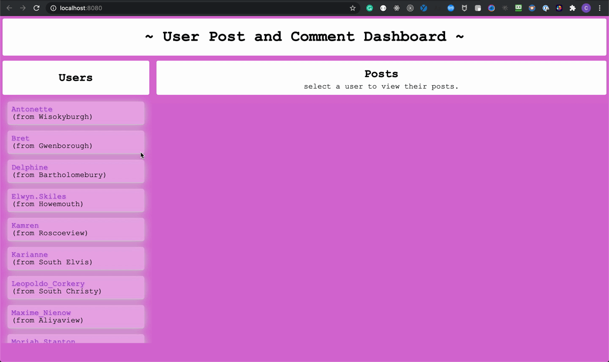

# Vanilla JavaScript
## Running the Project
- clone this section to your machine by running `git clone
  https://github.com/appacademy/assessment-for-week-EXIT-version-a-vanilla-js.git`
  ### Setup
- run `npm install` to install dependencies before starting this section.
  ### Dev Server
After installing dependencies, the following commands are available:

- To run the development environment (webpack and webpack-dev-server with live
  updates to JS and SCSS files), use `npm run start`
- To run webpack and watch for changes without a live server to see changes, use
  `npm run webpack:watch`

## Testing the project
- To run the tests once, use `npm run test`
- To run the tests and watch for changes, use `npm run test:watch`

## Constraints

- this section should be completed using ONLY Vanilla JavaScript.
- Please do not edit the HTML or SCSS files, you should only need to use
  JavaScript to complete the project

## Instructions

- make sure to review the HTML provided before started the DOM manipulation
  portion of the project

### API Calls

- In `/src/scripts/api-utils.js` you should write and `export` 3 functions:
  - `getAllUsers` should fetch all users from
    https://jsonplaceholder.typicode.com/users and return them as an array of
    user objects
  - `getUserPosts` should take a userId as a parameter, fetch all of that user's
    posts from
    [https://jsonplaceholder.typicode.com/posts?userId=\<userId\>](https://jsonplaceholder.typicode.com/posts?userId=),
    and return them as an array of post objects
  - `getPostComments` should take a postId as a parameter, fetch all of that
    post's comments from
    [https://jsonplaceholder.typicode.com/posts/\<postId\>/comments](https://jsonplaceholder.typicode.com/posts//comments)
    and return them as an array of comment objects

> 
<u><strong>HINT</strong></u>

> • All 3 API endpoints used above return a stringified JSON array as a response.
>
> • Since we are relying on GET requests, we can preview the JSON by visiting
> the API endpoint directly in the browser.
>
> • You can change the function declaration type (and/or incorporate async await
> logic if preferred)

### Index.js

- `/src/index.js` serves as an entry file for webpack
  - additionally, it (1) adds an event listener to the window for the
    `DOMContentLoaded` event and (2) defines a callback `main` that configures
    the modal and renders users
  - **No edits need to be made to the index.js file**. It relies on functions
    imported from `/src/scripts/render-users.js`

### renderUsers.js

- `/src/scripts/render-users.js` should export a default function called
  `renderUsers` (to be imported by the index.js file)
- Once the DOM is loaded, the function will be triggered
- `renderUsers` should:
  1. invoke getAllUsers to fetch all users from the API
     > NOTE: the `getAllUsers` method is already imported into the file for you
     > from `/src/scripts/api-util.js`
  2. alphabetize the users
  3. generate a collection of HTML elements (one for every user)
     - each element should contain a paragraph with the user's name and a
       paragraph with the user's city
     - each element should have a click event listener attached that calls
       `renderPosts` with an argument of `user.id`
       > NOTE: the `renderPosts` method is already imported into the file for
       > you from `/src/scripts/render-posts.js`
  4. append the collection of user elements to the `article.users-list`

### renderPosts.js

- `/src/scripts/render-posts.js` should export a default function called
  `renderPosts` (to be imported by the renderUsers.js file)
- Once a user is clicked, the function should be invoked with the appropriate
  userId
- `renderPosts` should:

1. take a `userId` as an argument
2. return an event handler which does the following:
   1. removes the existing content of the `.posts-list` element
   2. fetches all of the selected user's posts
      > NOTE: the `getUserPosts` method is already imported into the file for
      > you from `/src/scripts/api-util.js`
   3. generates a collection of HTML elements (one for each post) - each element
      should contain the post's title and body content - each element should
      have a click event listener attached that calls `renderComments` with an
      argument of `post.id`
      > NOTE: the `renderComments` method is already imported into the file for
      > you from `/src/scripts/render-comments.js`
   4. append the collection of post elements to the `article.posts-list`
   5. change the content of the `p.click-instruction` element to read "click on
      a post to view comments."

### renderComments.js

- `/src/scripts/render-comments.js` should export a function called
  `renderComments` (to be imported by the renderPosts.js file) and a function
  called `configureModal` (to be imported by the index.js file)
  > NOTE: Because we are exporting 2 functions from this file, we do not want to
  > export either as a default
- Once a post is clicked, `renderComments` should be invoked with the
  appropriate `postId` as an argument
- `renderComments` should:
  1. take a `postId` as an argument
  2. return an event handler which does the following:
     1. removes the existing content of the `.comments-list` element
     2. toggles the visibility of the `modal-background-overlay` element
     3. fetches the post's comments
        > NOTE: the `getPostComments` method is already imported into the file
        > for you from `/src/scripts/api-util.js`
     4. generates a collection of HTML elements (one for each comment)
        - each element should contain the comment's name, the email of the
          commenter, and the comment's body content
     5. append the collection of comment elements to the `article.comments-list`
- `configureModal` should:
  1. apply a click event listener to the `.modal-background-overlay` element
     that should:
     - hide the element if a user clicks outside of the modal
       > hint: the `hidden` class is provided by default

